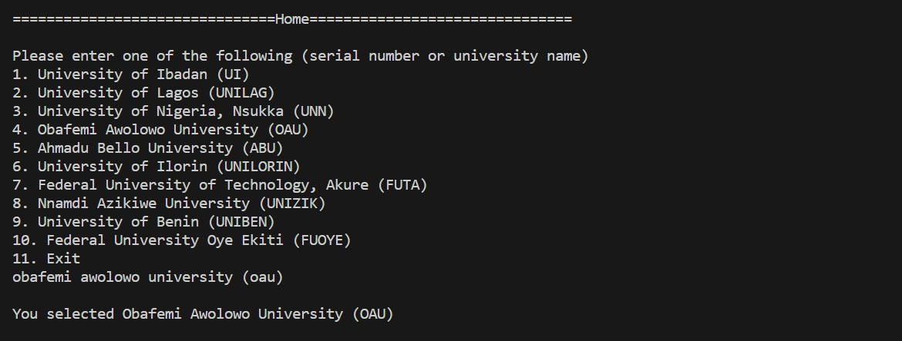
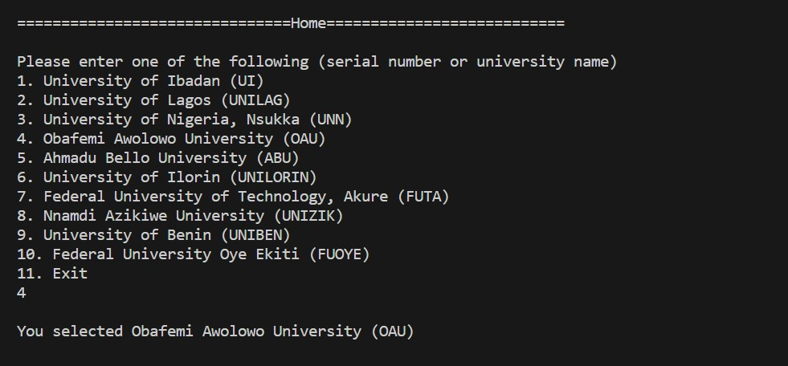

# MERIT

## A program that helps check if students are qualified to study their dream course in their dream University by using their credentials.

This project was built to aid Nigerian students in their admission process into tetiary Institutions. It helps students to make the right choices when it comes to matters pertaining to course and Institution. Not only does it do this in a very short time, but it also makes the whole process far more easier and less stressful. Here are some very important features of Merit.

* Calculating a student's aggregate score by using their credentials e.g olevel, UTME, and POST UTME results.
* Predicting the POST UTME score a student needs to achieve in order to be considered for admission.
* Letting the User know whether they are qualified to study their dream course or not.
* Recommendig other courses which they are qualified to study.
* Displaying to the student the score needed in order to study their course of choice in their dream university.
* Basic info about a selected University.
* Listing out all courses (undergraduate) offered in a selected University.
* Listing out all the faculties and courses (undergraduate) under them.
* Displaying the list of universities currently supported by Merit.

## Here's a Screenshot!

## How to use Merit!

1. Clone this project to your local machine using the command line on (ubuntu, Vs code) e.t.c
2. Install python

    ### For Linux/Ubuntu:
    'sudo apt-get update'
    'sudo apt-get install python3'

    ### For macOS:
    'brew install python'

    ### For Windows:
    'choco install python'

    You can verify if python installation was successful by running 'python --version'

3. Run this command to install the package Pyinputplus 'pip install pyinputplus' or 'pip3 install pyinputplus'

4. Start Merit by running the command 'python3 general.py'

5. You can navigate/perform an action in merit by typing out the action or just entering the serial number to the action which is much easier.
    a. Typing out the action.
    

    b. Entering the serial number to the action.
    

    You can enter a course using this same technique. Entering credentials will require you to explicitly type out your grades.

6. Thanks for using Merit!

## Find a bug?
If you found an issue with merit or would like to submit an improvement to this project, please submit an issue using the issues tab.

## Contribute?
Merit is currently in need of a frontend application and an awesome graphical user interface.

## Known Issues (Work in progress)
* Merit currently supports 10 Universities out of which only 7 are fully functional.
* Storing departmental cut off marks data in mysql is being worked on.
* Some schools have made their departmental cut off marks and mode of admission private.

## Like this project?
Contact me on whatsapp => +2348101457299
